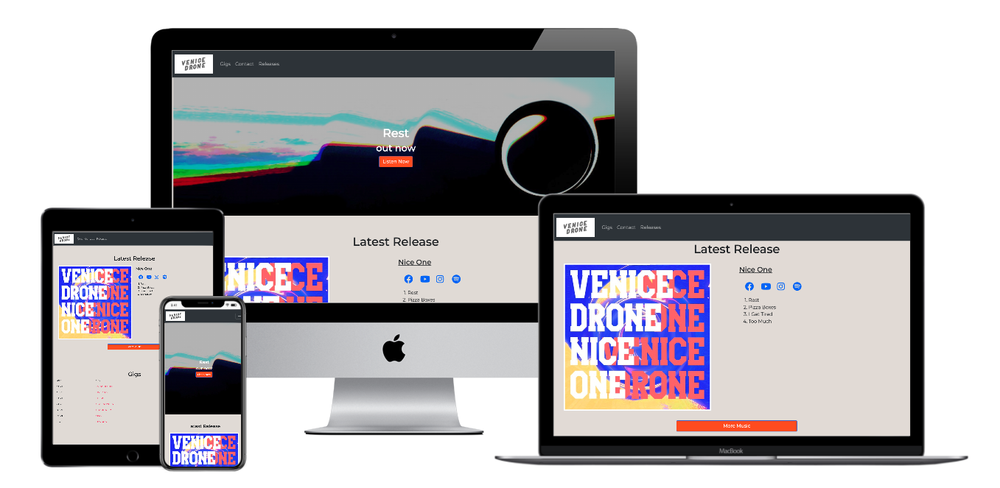
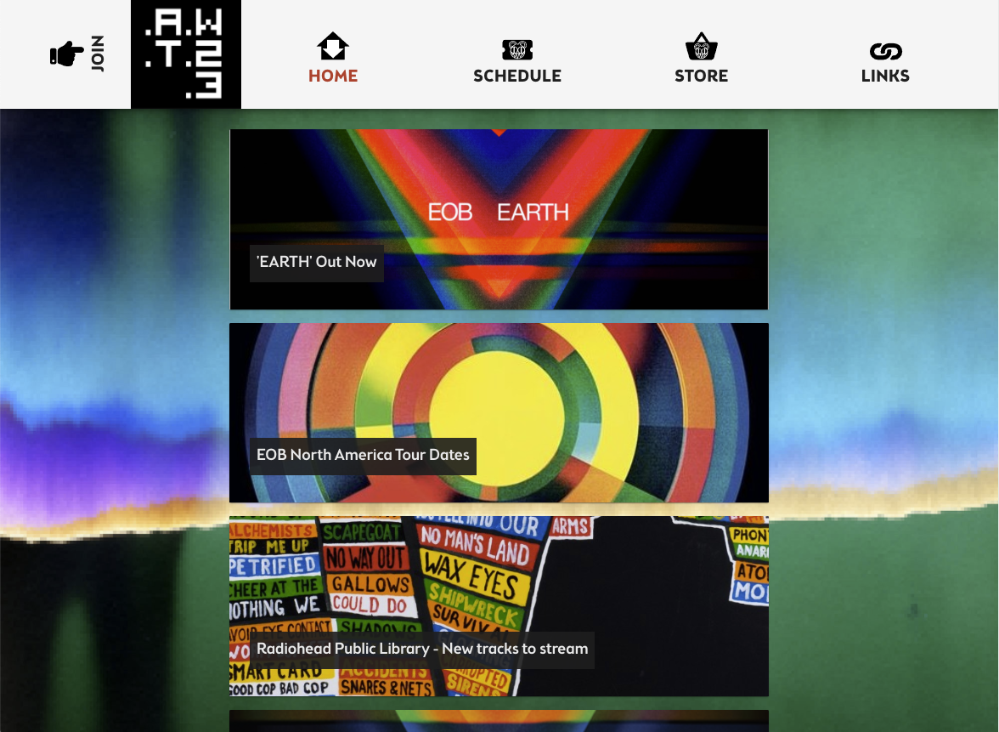
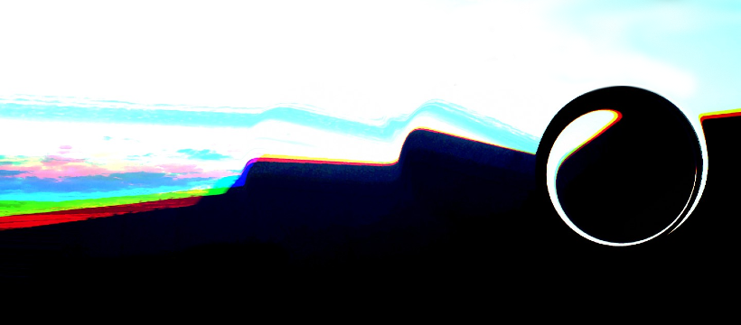
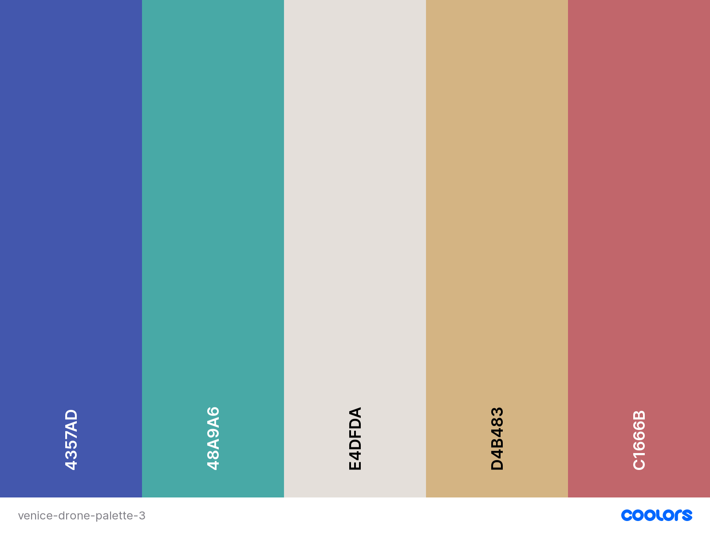

# Venice Drone - Band Website



Venice Drone is a band that make music. This site will showcase the latest releases by the band, make an archive of releases available to click through to, let users see upcoming gig dates with links to buy tickets and give a options for fans and industry to get in touch or book the band.

## UX

### Project Goals

Venice Drone are an extremely simple band in a very confusing time. The aim with this site is to provide the most important information, very easily and quickly and keep the delivery of such in theme with the bands' tone, and that of their fans.

### Target Audience Goals

#### Target Audience

- Established fans of the band
- New and curious visiters

#### User Goals

- A website that delivers the latest and current information first.
- A website that delivers the essial information that fans or new fans will want to see in one place:
  - Music links
  - Latest releases
  - Next gigs and upcoming dates
  - Social links
  - Direct contact information
- A chronologically curated archive of releases and video content.

#### User Stories

##### Mage Cunningham

"As a user I want to see what the band is up now, espescially what they released last"

##### Mr. Inana

"As a user I want to be able to find out how to book the band"

##### Mrs. SmithlyJiggles

"As a user I want a place to see the entire release history of the band"

#### Site Owner Goals

- Deliver latest news and releases in the first loading of the site
- Curate a chronological archive of material for people to link through to
- Provide links for fans to access content on the platform of their choice
- Deliver contact points for fans and industry professionals.

## User Requirements and Expectations

### User Requirements

- Familiar and easily navigation bar with clearly labeled sections
- Familiar tone to the band in the language and aesthetic.
- Current information and up to date links to social information.

### User Expectations

- To see songs they know, and be able to discover songs they may not have heard before
- Have an opportunity to contact the band.
- Find information to book press interviews and book shows with the band.
- Find out what is new and have an opportunity to catch up.

## **Design Choices**

The user experience is focused site-wide. The Venice Drone fanbase have a wide age range, so this site must be useable by teens and adults. For that reason each content section is seperated by a title header in a bold colour with to-the-point titles, and nice spacious margins around the content that is in focus for that section, which changes depending on view height.

I wanted to achieve a useable website, with a tone and copy that represented the bands precise and to-the-point nature. For this reason only the content that is new and being promoted is on the front page. And more content is under the nav bar sections on other pages.

They are a secretive, non-ego driven band with very little desire to share personal stories and damage the music with their own images. For this reason an 'about me' section was omitted.

The site is designed to be easily modifiable, since Venice Drone are an active band, when more content is released, it can easily be added to the site, and copied to the front page for a feature.
Other sites I referenced were [_Radioheads_ 'WASTE' site ](https://www.wasteheadquarters.com/) and [_Idles_ website](https://www.idlesband.com/) Particlarly the titles, dimentions, simplicity and direct tone.




### Fonts

The font used throughout the site is a simple DM MONO provided by [Google Fonts CDN](https://fonts.google.com/specimen/DM+Mono) . The spacious and unobtrusive nature of the font provided a clear adn direct approach to copy impact.

### Icons

Icons were provided through the Bootstrap reccomended [Font Awesome](https://fontawesome.com/).

### Colours

In the current iteration of the site the colours are generated from the artwork of the latest release by the band.



The off set RGB light scatter and black hole image were striking enough, and lended to a delightful palette:



## Wireframes


Some features changed during the build, but the change from version 1 and version 2 to version 3 proved to be a much more functional platform to build from. The design stopped being so spread out and instead simplifeid and streamlined.

## Features

- Landing page provides all essential information at first sight.
- Contact form
- Links to social platforms
- Links to social audio platforms
- Links to social video platforms
- Upcoming gig table in chronological order

## Features that will be implimented in the future

- Direct downloads of tracks and videos from the site
- Media player for online content
- Shop for merchendise
- Band curated image library
- Further reading section

## Technologies Used

### Languages

- [HTML5](https://w3.org/html)
- [CSS](https://w3.org/css)

### Libraries & Frameworks

- [Bootstrap](https://getbootstrap.com/)
- [Git](https://git-scm.com/)
- [Google Fonts](https://fonts.google.com/)
- [Font Awesome](https://fontawesome.com/)

### Tools Used

- [Visual Studio Code](https://code.visualstudio.com/) - The project used the **Visual Studio** 
- [HTML Validator](https://validator.w3.org/) - The project used the **HTML Validator** to validate and find errors in the HTML.
- [CSS Validator](https://jigsaw.w3.org/css-validator/) -The project used the **CSS Validator** to validate and find errors in the CSS.
- [Balsamiq](https://balsamiq.com) - The project used the **Balsamiq** to create wireframes for the site.
- [Chrome](https://www.google.com/intl/en/chrome/) developer tools.

## Testing

I've been testing the site with the band themselves and with their sposes and partners. Focusing on features that they deemed necessary, and tone that they find on-brand. The final version and the final wireframe shows the journey through testing to release. The Logo in the nav bar nearly proved too distracting first, followed by the .gif background idea - simplified the site.

I used VS Code Extentions to preview the site in different browsers, via Chrome. Extensively testing the layout changes at all media breakpoints. This process was made easier with **Bootstrap**.

### Testing stories 

- There was a recurring layout issue in the medium break point where the media boxes align the album artwork and the text left to the box, leaving a lot of wasted space on the right of the box. And a <750px but >1080px alignment of the social icons in the contact page. This was fixed with a stricter focus on the implimentation of the Bootstrap framework.

- During the creation of the media boxes that have the album artwork and the tracklisting, year, and social links next to them, there were constant back and forth with designs in different sizes and breakpoints showing all sorts of errors. Specifically in the smallest viewpoint, all content would over lap each other. Again this was fixed with a stricter focus on Bootstrap conatiner-row-column documentation.

- The nav logo was another particualy difficult design exploration - the size and shape of it to keep it out of the way but also relevent was extremely difficult.

## Deployment

**Venice Drone Band Website** was developed on **VS Code**, using **git** and **GitHub** to host the repository.

When deploying **Venice Drone Band Wesbite** using **GitHub Pages** the following steps were made:

- Opened up **GitHub** in the browser.
- Signed in using username and password.
- Selected my **repositories**.
- Navigated to **'/lornebb/Venice-Drone-Website'**.
- In the top navigation clicked **'settings'**.
- Scrolled down to the **GitHub Pages** area.
- Selected **'Master Branch'** from the **'Source'** dropdown menu.
- Clicked to confirm my selection.
- **Venice Drone Band Website** now live on GitHub Pages.

### Running Venice Drone Band Website Locally

Cloning **Venice Drone Band Website** from **GitHub**:

- Navigate to **'/lornebb/Venice-Drone-Website'**.
- Click the green **'Clone or Download'** button in the top right.
- Copy the **url** in the dropdown box.
- Using your favourite **IDE** open up your preferred **terminal**.
- Navigate to your desired file location.
- Copy the following **code** and input it into your terminal to clone Holiday Destinations.

```bash
git clone https://github.com/lornebb/Venice-Drone-Website.git
```

## Credits

This site was made for educational purposes only by Lorne Ashley Brigham-Bowes, 2020.

- [**Chris Palmer**](https://github.com/cgpalmer) - helped with my rebuild and kept my thinking and implimentaion simple.
- **CI Student care** - For getting me off the ground with my first IRL CDN.
- [Bootstrap snippets](https://bootsnipp.com/snippets/GqBjl)
- [Simen Daehlin](https://github.com/Eventyret) - my mentor during this build, provided above and beyond help to teach me how to make it reach a standard I could be proud of.

### Content

- The copy used for the _make contact_ section was copied and heavily edited for privacy from the [Idles Press & Bookings](https://www.idlesband.com/press-bookings/) page.
- CSS and HTML help was found on [MDN Web Docs](https://developer.mozilla.org/en-US/) and [Stack Overflow](https://stackoverflow.com/).

### Media

- All media in this project is created by Venice Drone.

### Acknowledgements

- I received inspiration for this project frommy fellow students and the wonderful team on slack, my good friend Dave at [EightArms](https://eightarms.co.uk/), and a thank you to my mentors, Antonjia and Simen.
